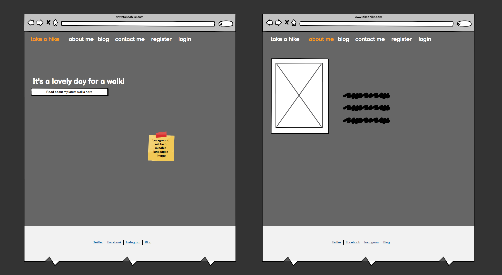
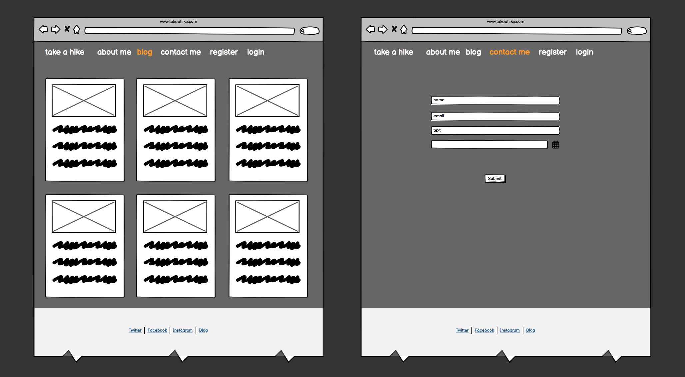
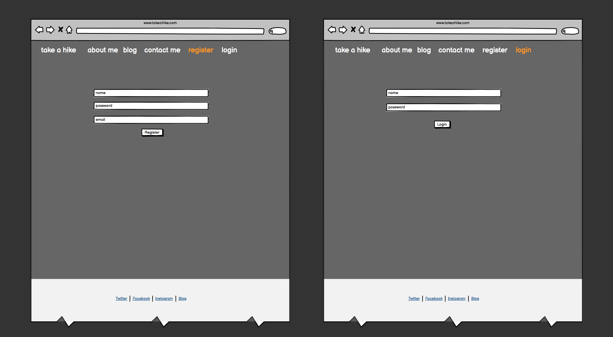
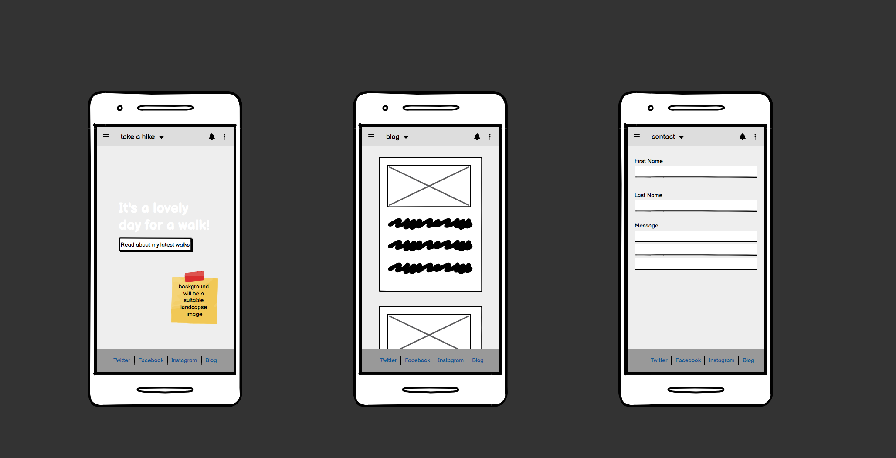

 
 
 

**TABLE OF CONTENTS**

 
 
 

# **ABOUT Take a Hike**

XXXXXX **[here](https://#.herokuapp.com/)**.

 
 
 

# **LOGIC CHART**

 
 
 

# **AGILE PLANNING**

**USER STORIES**

**TASKS**

**MILESTONES**

# **THE STRATEGY PLANE**

**Visitor Goals**

* XXX
* XXX
* XXX
* XXX

**Targeted Users**

**Project Goals**

# **THE SKELETON PLANE**

**Wireframes**

**Desktop**

**Mobile**

# **THE SCOPE PLANE**

# **THE STRUCTURE PLANE**

**Features**

**Homepage**

**About Me**
**Blog**
**Contact Me**
**Register**
**Login**

# **THE SURFACE PLANE**
**Colour Scheme**
**Typography**
**Images**

 
 
 

# **FUTURE FEATURES**

* XXX
* XXX
* XXX

 
 
 

# **TECHNOLOGIES**

**Languages Used**
* Python
* Markdown

**Libraries and Frameworks**

**Tools and Resources**

 
 
 

# **RESOURCES**

* **Gitpod** - to create the website and version control
* **Github** - to save and store the files for the website
* **Adobe Illustrator** - to create the logo and various headings
* **Texteditor.com** - for ASCII text art
* **CI Python Linter** - to test Python code
* **Slack, Stackoverflow, Youtube, Google, W3C Schools** - for help with troubleshooting errors
* **Freeconvert.com** - to compress mp4
* **Ezgif.com**- to convert compressed mp4 to gif for README
* **Record It Pro** - for screen-capturing video and converting mp4 to gif
* **GitHub Wiki TOC generator** - for generating README Table of Contents

 
 
 

# **MANUAL TESTING**
XXXXX
 

 

|**FEATURE**|**EXPECTED**|**ACTION**|**RESULT**|**SCREENSHOT**|
|:---|:---|:---|:---|:---|
| Intro | To display on load | Run game | As expected | 
| Enter Name | To appear underneath title | Input alphanumeric name, hit enter | As expected | 

 
 
 

# **VALIDATION**
**CI Python Linter**

 
 
 

# **BUGS**

* **Expected** - xxx
* **Testing** - I ran the site using terminal. 
* **Result** - xxx
* **Fix** - xxx

---

* **Expected** - xxx
* **Testing** - I ran the site using terminal. 
* **Result** - xxx
* **Fix** - xxx

---

 
 
 

# **KNOWN ISSUES**
No known issues
 
 
 

# **DEPLOYMENT**

* The site was deployed on Heroku 

* Open Heroku account.
* From the Heroku dashboard click the “Create new app” button.
* Name the app, the name has to be unique.
* Select region and click “Create app”. 
* Click on the settings tab.  
* Click “Add buildpack” here.
* Select Python then click “Save changes”.
* Select node.js and click “Save” again.
* Buildpacks must be in this order, with Python on top and node.js underneath.
* Go to the deploy section.  
* Select Github and confirm that we want to connect to Github.  
* Search for the Github repository name and once found click “connect”  
* Choose to manually deploy using the deploy branch option.  
* After creation you get an “App was successfully deployed” message  
with a button to take us to our deployed link. 

 
 
 

# **HOW TO FORK**

* Login/signup to GitHub.

 
 

* Locate the relevant repository, for example: https://github.com/frapplecat/

 
 

* Click on the 'Fork' button in the top right corner.

 
 

* The forked version of this repo will be generated.

 
 
 

# **HOW TO CLONE**

* On GitHub.com, navigate to the main page of the repository.

 
 

* Above the list of files, click Code.

 
 

* Copy the URL for the repository.

 
 

* Open Terminal.

 
 

* Change the current working directory to the location where you want the cloned directory.
* Type git clone, and then paste the URL you copied earlier.

 
 

* Press Enter to create your local clone.

 
 
 

# **VERSION CONTROL**

I used GITPOD for version control software. Regular git add ., git commit -m, and git push were used to add, save and push the code to the GITHUB Repo where the source code is stored.

 
 
 

# **CREDITS**

* I watched many youtube tutorials on... but in particular **[#](https://www.#)**

 
 
 

# **ACKNOWLEDGEMENTS**

* Thanks as always to my Code Institute Mentor, Mitko Backvarov, for his support, advice and encouragement.
